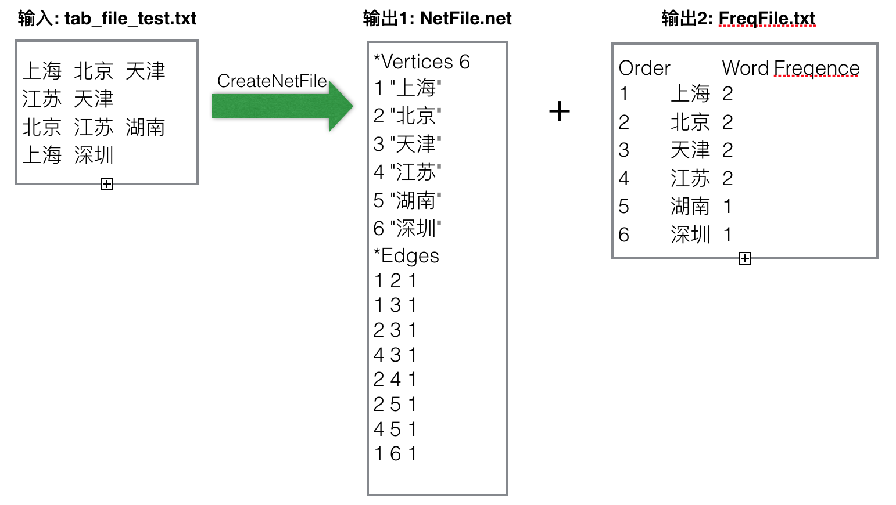

# CreateNetFile
一个跨平台的pajek数据格式文件生成器

### 功能
* 高效迅速地将 <Tab> 分隔的文本文件转换成 pajek 程序所需的 .net 文件
* 词频统计功能

功能如下所示：

### 支持平台
* MacOSX/Xcode
* Linux/g++
* Windows/Visual Studio

### 相关资料
* 可运行程序：http://pan.baidu.com/s/1b2JWcQ；如果在 MacOSX/Linux 上无法正确识别命令，请用 sudo chmod x+u CreateNetFile_mac64bit  命令为程序添加执行功能。
* 原理请参考：https://blog.exbye.com/2016/05/pajek-net-file-creator-with-multi-platforms/
* 欢迎在GitHub上提出相关的issue.